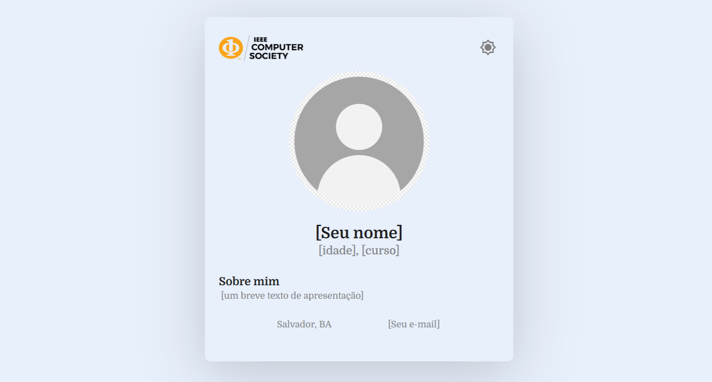
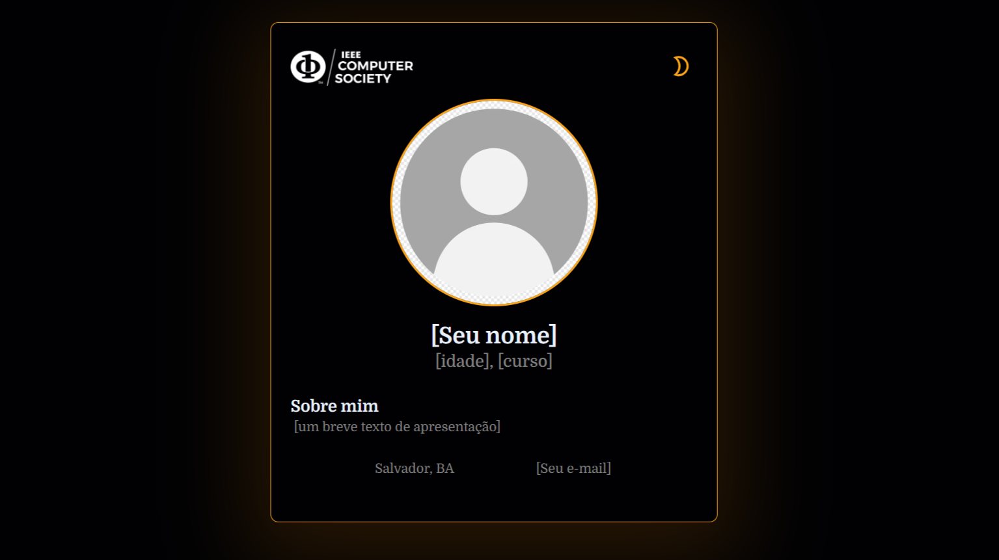

# Desafio 2 - CS Card

Agora você conhece o funcionamento de box-model, flexbox e grid. Isso significa que você tem conhecimento suficiente para posicionar diversos elementos numa tela. Vamos praticar?

Este repositório possui uma página parcialmente estilizada. Sua tarefa é **selecionar as regras CSS adequadas para que página fique parecida com estas**:

**Atenção!** As únicas distinções entre os dois temas as são cores e a logo. Essas informações já estão configuradas, não se preocupe com elas.

Você deve alterar o arquivo [d2.css](assets/styles/d2.css).